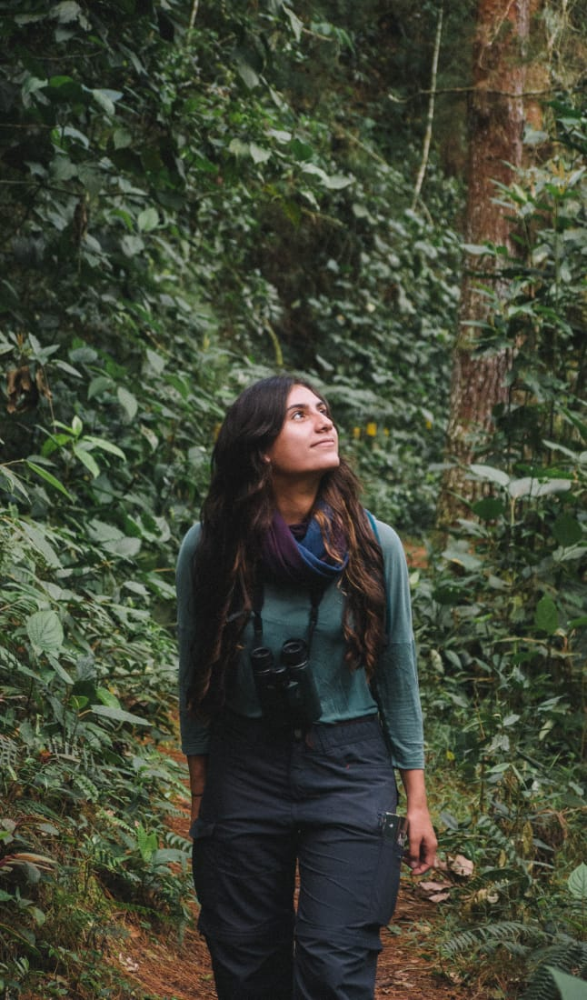

---
# You don't need to edit this file, it's empty on purpose.
# Edit theme's home layout instead if you wanna make some changes
# See: https://jekyllrb.com/docs/themes/#overriding-theme-defaults
layout: splash
author_profile: false
classes: wide
teaser: /assets/images/banner2.jpg
---

Hello and welcome to my website! This is Juliana, a Colombian biologist and ornithologist interested in understanding animal behavior, particularly in birds. Among the fascinating gamut of behaviors that birds can display, I am passionate about avian brood parasitism. Over the last years of my career, I have committed myself to study this behavior and learn about what is known of parasite birds that cheat by nature on other bird species.

My research interest is focused on:

  -  Evolution of eggshell coloration
  -  Host-parasite coevolution
  -  Visual and color perception

